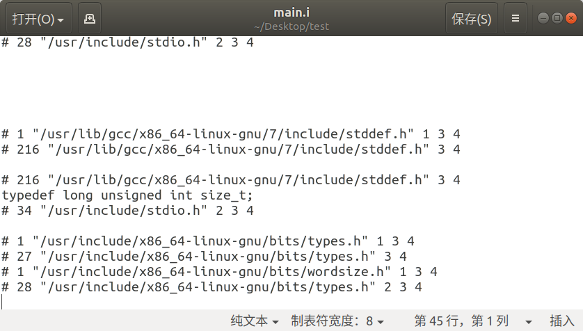

# GCC 编译过程

下面用一个小例子来说明GCC的编译过程  

main.c
```c++
#include<stdio.h>
extern void print(void);

int main(void){
	print();
	return 0;
}
```

test.c
```c++
void print(void){
    printf("%s", "hello world\n");
}
```

## 1. 预处理
以“#”号开头的预处理指令如包含#include,宏定义制定#define等。在源程序中这些指令都放在函数之外，而且一般放在源文件的前面。  
使用预处理器把源文件test.c经过预处理生成test.i文件。  
预处理的命令为：  
`gcc -E test.c -o test.i`

结果为：  
```shell script
wbh@wbh-virtual-machine:~/Desktop/test$ gcc -E test.c -o test.i
wbh@wbh-virtual-machine:~/Desktop/test$ gcc -E main.c -o main.i
wbh@wbh-virtual-machine:~/Desktop/test$ ll
总用量 40
drwxrwxr-x 2 wbh wbh  4096 9月  25 12:38 ./
drwxr-xr-x 7 wbh wbh  4096 9月  25 12:04 ../
-rw-r--r-- 1 wbh wbh    84 9月  25 12:13 main.c
-rw-r--r-- 1 wbh wbh 17942 9月  25 12:38 main.i
-rw-r--r-- 1 wbh wbh    58 9月  25 12:36 test.c
-rw-r--r-- 1 wbh wbh   205 9月  25 12:36 test.i
```
可以看到生成两个.i文件,这就是预处理之后的文件,而且main.i文件比main.c文件大很多，这是因为把stdio库都处理进去了。  


## 2. 编译
编译指的是将预处理过的源文件(test.i, main.i)转换为汇编文件（test.o, main.o）  
命令为:  
`gcc -S main.i -o main.s`

结果为：  
```shell script
wbh@wbh-virtual-machine:~/Desktop/test$ gcc -S test.i -o test.s
wbh@wbh-virtual-machine:~/Desktop/test$ gcc -S main.i -o main.s
wbh@wbh-virtual-machine:~/Desktop/test$ ll
总用量 48
drwxrwxr-x 2 wbh wbh  4096 9月  25 13:01 ./
drwxr-xr-x 7 wbh wbh  4096 9月  25 12:04 ../
-rw-r--r-- 1 wbh wbh    84 9月  25 12:13 main.c
-rw-r--r-- 1 wbh wbh 17942 9月  25 12:38 main.i
-rw-r--r-- 1 wbh wbh   383 9月  25 13:01 main.s
-rw-r--r-- 1 wbh wbh    58 9月  25 12:36 test.c
-rw-r--r-- 1 wbh wbh   205 9月  25 12:36 test.i
-rw-r--r-- 1 wbh wbh   454 9月  25 13:00 test.s

```
可以看到test.s文件内容为汇编代码
```asm
	.file	"test.c"
	.text
	.section	.rodata
.LC0:
	.string	"hello world"
	.text
	.globl	print
	.type	print, @function
print:
.LFB0:
	.cfi_startproc
	pushq	%rbp
	.cfi_def_cfa_offset 16
	.cfi_offset 6, -16
	movq	%rsp, %rbp
	.cfi_def_cfa_register 6
	leaq	.LC0(%rip), %rdi
	call	puts@PLT
	nop
	popq	%rbp
	.cfi_def_cfa 7, 8
	ret
	.cfi_endproc
.LFE0:
	.size	print, .-print
	.ident	"GCC: (Ubuntu 7.5.0-3ubuntu1~18.04) 7.5.0"
	.section	.note.GNU-stack,"",@progbits
```


## 3. 汇编
这一部使用上一步生成的汇编代码.s，并转换为目标文件.o  
命令为：  
`gcc -C main.s test.s -o main.o`
结果为：  
```shell script
wbh@wbh-virtual-machine:~/Desktop/test$ gcc -C main.s test.s -o main.o
wbh@wbh-virtual-machine:~/Desktop/test$ ll
总用量 60
drwxrwxr-x 2 wbh wbh  4096 9月  25 13:08 ./
drwxr-xr-x 7 wbh wbh  4096 9月  25 12:04 ../
-rw-r--r-- 1 wbh wbh    84 9月  25 12:13 main.c
-rw-r--r-- 1 wbh wbh 17942 9月  25 12:38 main.i
-rwxr-xr-x 1 wbh wbh  8360 9月  25 13:08 main.o*
-rw-r--r-- 1 wbh wbh   383 9月  25 13:01 main.s
-rw-r--r-- 1 wbh wbh    58 9月  25 12:36 test.c
-rw-r--r-- 1 wbh wbh   205 9月  25 12:36 test.i
-rw-r--r-- 1 wbh wbh   454 9月  25 13:00 test.s
```

main.o为目标文件，二进制格式

## 4. 链接
链接过程使用链接器将该目标文件与其他目标文件、库文件、启动文件等链接起来生成可执行文件。附加的目标文件包括静态连接库和动态连接库。  
命令为：  
`gcc main.o -o main`

结果为：  
```shell script
wbh@wbh-virtual-machine:~/Desktop/test$ ll
总用量 72
drwxrwxr-x 2 wbh wbh  4096 9月  25 13:11 ./
drwxr-xr-x 7 wbh wbh  4096 9月  25 12:04 ../
-rwxr-xr-x 1 wbh wbh  8360 9月  25 13:11 main*
-rw-r--r-- 1 wbh wbh    84 9月  25 12:13 main.c
-rw-r--r-- 1 wbh wbh 17942 9月  25 12:38 main.i
-rwxr-xr-x 1 wbh wbh  8360 9月  25 13:08 main.o*
-rw-r--r-- 1 wbh wbh   383 9月  25 13:01 main.s
-rw-r--r-- 1 wbh wbh    58 9月  25 12:36 test.c
-rw-r--r-- 1 wbh wbh   205 9月  25 12:36 test.i
-rw-r--r-- 1 wbh wbh   454 9月  25 13:00 test.s
wbh@wbh-virtual-machine:~/Desktop/test$ ./main
hello world
```

其中main为可执行文件

## 总结
生成可执行程序过程为成四个步骤：  

1. 由.c文件到.i文件，这个过程叫预处理。
2. 由.i文件到.s文件，这个过程叫编译。
3. 由.s文件到.o文件，这个过程叫汇编。
4. 由.o文件到可执行文件，这个过程叫链接。